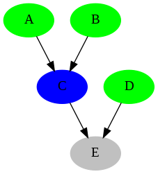

+++ 
draft = false
date = 2025-09-13T23:26:50-04:00
title = "A Quick Overview of Data Pipelines Status"
description = ""
slug = ""
authors = []
tags = []
categories = []
externalLink = ""
series = []
+++

You probably know the importance of monitoring your data pipelines. But have you ever wondered how to visualize their status effectively? How can I quickly check what is going on with my data pipelines? One way to achieve this is to create a graph where each node is a data pipeline, and the edges represent dependencies between them. The color of each node indicates the status of the pipeline (e.g., green for success, red for failure, blue for running, etc). 

Example: Let's say you have the pipeline `E` that depends on pipelines `C` and `D`, and pipeline `C` depends on pipelines `A` and `B`. If pipelines `A` and `B` are successful (green), pipeline `C` is currently running (blue), pipeline `D` is successful (green), and pipeline `E` hasn't started yet (grey). How can you quickly check the status of all pipelines?


```python
import graphviz

# Define the pipelines and their statuses
status_color = {
    'success': 'green',
    'failure': 'red',
    'running' : 'blue',
    'off' : 'grey'
}


# Define the connections (pairs of nodes)
connections = [
    ('A', 'C'),
    ('B', 'C'),
    ('C', 'E'),
    ('D', 'E'),
]

node_status = {
    'A': 'success',
    'B': 'success',
    'C': 'running',
    'D': 'success',
    'E': 'off',
}

# Create a directed graph object
dot = graphviz.Digraph(comment='Pipeline Status Graph', format='png')
dot.attr(shape='box', fixedsize='true')

# Add nodes with their respective colors
for node, status in node_status.items():
    dot.node(node, style='filled', color=status_color[status])

# Add edges to show the flow
for source, target in connections:
    dot.edge(source, target)

# Render the graph to a file
dot.render('pipeline_graph', view=True)

print("Graph saved as pipeline_graph.png")
```

And we can see the following image:

