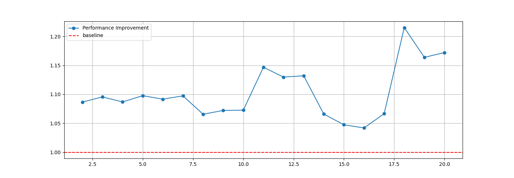
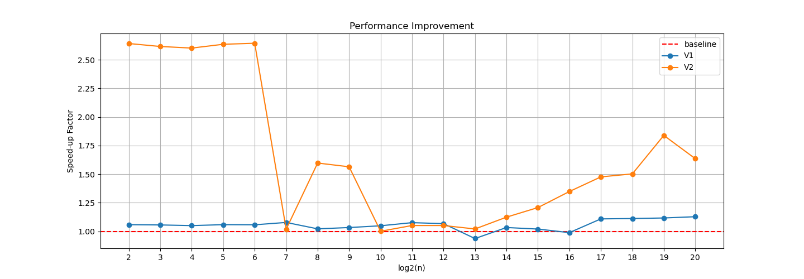
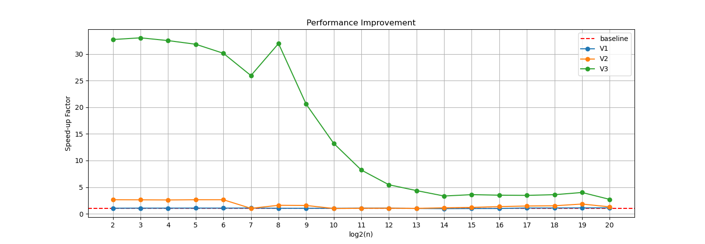

+++ 
draft = true
date = 2025-11-25T01:24:53-05:00
title = "Getting Faster RFFT in Python"
description = ""
slug = ""
authors = []
tags = []
categories = []
externalLink = ""
series = []
+++


Real Fast Fourier Transform (RFFT) is an algorithm that converts a real-valued signal from its time domain into its frequency components. Different libraries in python, such as NumPy, SciPy, and [pyFFTW](https://pyfftw.readthedocs.io/en/latest/source/pyfftw/builders/builders.html), provide an API for RFFT. However, their performance can vary. The focus of this post is to demonstrate how to use pyFFTW properly. pyFFTW is a Python wrapper for the [FFTW](https://www.fftw.org), which is known for its speed and efficiency in computing Fourier transforms. 


## Installation
[FFTW](https://www.fftw.org) is one of the requirements of pyFFTW that needs to be installed first, and it does not come bundled with pyFFTW. The easiest way to install it is through `conda`. I assume you have `conda` installed, and you know how to create and activate a conda environment. The minimum python version for pyFFTW is `3.11` (as of November 2025).

Once you are in your environment, install `FFTW` by running the following command:
```bash
conda install conda-forge::fftw
```

And, the other dependencies can be installed when installing pyFFTW:

```bash
conda install conda-forge::pyfftw
``` 


Now, we are ready to use pyFFTW in our code!


## Example Code
The following code demonstrates how to use pyFFTW to perform RFFT on a real-valued signal. 

```python
import numpy as np
import pyfftw

T = np.random.rand(4)
rfft_obj = pyfftw.builders.rfft(np.empty(len(T), dtype='float64'))
R = rfft_obj(T)

# verify the result
R_ref = np.fft.rfft(T)
np.testing.assert_allclose(R, R_ref)
```

In this code, we created a RFFT object using `pyfftw.builders.rfft`. We then use this object to compute the RFFT of the real-valued array `T`. Finally, we verify the result by comparing it with the output of NumPy's RFFT. 


## Performance Optimization
The RFFT on arrays with different sizes can have different performance. The performance of RFFT can be significantly improved when input arrays have specific sizes (e.g., powers of two). Here we consider input sizes that are powers of two, and try to find ways to improve the performnace of RFFT in those cases. 


### Timing
Let's start by preparing a script that can get the timing of RFFT computation using pyFFTW.

```python
def _get_timing_single(n, rfft_caller, timeout=5.0):
    """
    For a single input size n, return the time taken to compute RFFT using rfft_caller
    """
    pyfftw.forget_wisdom()  # clean up any previous plans
    T = np.random.rand(n)

    R = rfft_caller(T) # dummy to create wisdom
    R_ref = np.fft.rfft(T)
    np.testing.assert_allclose(R, R_ref)

    total_time = 0.0
    count = 0
    while total_time < timeout:
        start_time = time.perf_counter()
        rfft_caller(T)
        total_time += time.perf_counter() - start_time
        count += 1

    return total_time / count


def get_timing(n_values, rfft_caller, timeout=5.0, verbose=True):
    """
    n_values: an array of input sizes
    """
    timing = np.full(len(n_values), -1.0, dtype='float64')
    for i, n in enumerate(n_values):
        if verbose:
            print(f"log2(n) --> {int(np.log2(n))}", flush=True)
        timing[i] = _get_timing_single(n, rfft_caller, timeout=timeout)
    return timing
```


Let's start with a baseline implementation of RFFT using pyFFTW.

### Baseline (V0)
```python
import numpy as np
import pyfftw
import time


def rfft_caller_v0(T):
    """
    Create and return a RFFT caller function for input size n
    """
    rfft_obj = pyfftw.builders.rfft(np.empty(len(T)))
    
    return rfft_obj(T)
```

And before moving further, let's prepare a script that is flexible enough to run different versions of the timing function, and plot the performance results:

```python
rfft_callers = {
    'V0': rfft_caller_v0,
    # Add other versions here later
}

p_min = 2
p_max = 20
timeout = 5.0

n_values = np.power(2, np.arange(p_min, p_max + 1))

timing_results = {}
for version, caller in rfft_callers.items():
    print(f'Getting timing for {version} ...')
    timing_results[version] = get_timing(n_values, rfft_caller=caller, timeout=timeout)

plt.figure(figsize=(15, 5))
plt.title('Performance Improvement')

for version, timing in timing_results.items():
    if version == 'V0':
        plt.axhline(y=1.0, color='r', linestyle='--', label='baseline')  # baseline
    else: 
        plt.plot(
            np.arange(p_min, p_max + 1),
            timing_results['V0'] / timing,
            label=version,
            marker='o'
        )

plt.xticks(
    ticks=np.arange(p_min, p_max + 1),
    labels=np.arange(p_min, p_max + 1),
)
plt.xlabel('log2(n)')
plt.ylabel('Speed-up Factor')
plt.grid()
plt.legend()
plt.show()
```

There a few things to note in the above code:
1. We use `pyfftw.forget_wisdom()` to clear any previous plans. This is to make sure tha we start fresh
2. We run a pyfftw's object to initialize the wisdom. So, the wisdom overhead is not counted in the timing.
3. We verify the correctness of the RFFT result by comparing it with NumPy's RFFT output.

Let's see how we can improve the performance!

### First Attempt: Byte-align the input array in advance (V1)
To improve the performance, `pyfftw` internally byte-aligns the input array. One idea is to create a byte-aligned array in advance, and reuse this array. This allows to avoid unnecessary copies of the input data that might happen within the RFFT computation. 

```python
class rfft_caller_v1:
    def __init__(self):
        self.real_arr = None

    def __call__(self, T):
        if self.real_arr is None or len(T) != len(self.real_arr):
            self.real_arr = pyfftw.empty_aligned(len(T), dtype='float64')
        
        rfft_obj = pyfftw.builders.rfft(self.real_arr, overwrite_input=True, avoid_copy=True)
        self.real_arr[:] = T
        rfft_obj.execute()
        
        return rfft_obj.output_array
```

In this modified version, an instance of the class `rfft_caller_v1` can be used to compute the RFFT. It holds the byte-aligned array `real_arr`, as an attribute, after the first call. When the `__call__` method is invoked again, it checks if the size of the input array `T` matches the size of the existing aligned array, and if yes, it reuses the existing byte-aligned array. Let's update the dictionary `rfft_callers` to include this new version:

```python
rfft_callers = {
    'V0': rfft_caller_v0,
    'V1': rfft_caller_v1(),
}
```
Now, let's run the timing script to see the performance improvement:



As shown in the performance plot above, our first attempt to optimize the RFFT computation resulted in 5-10% speed-up for most cases except one. Not bad for a first try! Let's see if we can do better!!

### Second Attempt: Use pyfftw.FFTW object directly (V2)
Another idea to explore is to use the `pyfftw.FFTW` object directly instead of using the builder function. The builder function `pyfftw.builders.rfft` is a convenient way to create FFTW objects. This may introduce some overhead. So, on top of the previous optimization, we can try to use `pyfftw.FFTW` directly.

```python
class rfft_caller_v2:
    def __init__(self):
        self.real_arr = None
        self.complex_arr = None
    
    def __call__(self, T):
        if self.real_arr is None or len(T) != len(self.real_arr):
            self.real_arr = pyfftw.empty_aligned(len(T), dtype='float64')    
            self.complex_arr = pyfftw.empty_aligned(len(T) // 2 + 1, dtype='complex128')  

        rfft_obj = pyfftw.FFTW(
            self.real_arr,
            self.complex_arr,
            direction='FFTW_FORWARD',
            flags=('FFTW_MEASURE', 'FFTW_DESTROY_INPUT'),
            threads=1,
        )    
        self.real_arr[:] = T
        rfft_obj.execute()

        return self.complex_arr
```

Note that, in addition to the input array, we also create an output array `complex_arr` to hold the RFFT result. Let's update the dictionary `rfft_callers` to include this new version:

```python
rfft_callers = {
    'V0': rfft_caller_v0,
    'V1': rfft_caller_v1(),
    'V2': rfft_caller_v2(),
}
```



As shown in the performance plot above, using `pyfftw.FFTW` directly resulted in a significant performance improvement compared to the previous version. We achieved up to 2.5x speed-up for short-size arrays (arrays with lengths `<2^7`), and around 1.5x speed-up for larger arrays, where the length of arrays is `>2^15`. For array sizes in between, we observed that the speed-up is less than 25% for most cases. 

### Attemp 3: Reuse the RFFT object (V3)
Another optimization we can try is to reuse the RFFT object across multiple executions. Creating the RFFT object might have some overhead. Therefore, reusing it might improve the performance. 

```python
class rfft_caller_v3:
    def __init__(self):
        self.real_arr = None
        self.complex_arr = None
        self.rfft_obj = None
    
    
    def __call__(self, T):
        if self.real_arr is None or len(T) != len(self.real_arr):
            self.real_arr = pyfftw.empty_aligned(len(T), dtype='float64')    
            self.complex_arr = pyfftw.empty_aligned(len(T) // 2 + 1, dtype='complex128')

            self.rfft_obj = pyfftw.FFTW(
                    self.real_arr,
                    self.complex_arr,
                    direction='FFTW_FORWARD',
                    flags=('FFTW_MEASURE', 'FFTW_DESTROY_INPUT'),
                    threads=1,
                ) 
           
        self.real_arr[:] = T
        self.rfft_obj.execute()

        return self.complex_arr
```

Let's update the dictionary `rfft_callers` to include this new version:

```python
rfft_callers = {
    'V0': rfft_caller_v0,
    'V1': rfft_caller_v1(),
    'V2': rfft_caller_v2(),
    'V3': rfft_caller_v3(),
}
```



As shown in the performance plot above, reusing the RFFT object resulted in a huge performance improvement compared to the previous versions. We achieved up to 30x speed-up for arrays with lengths `<2^8`. And from that point on, the speed-up gradually decreases to around 2x-3x for larger arrays`.