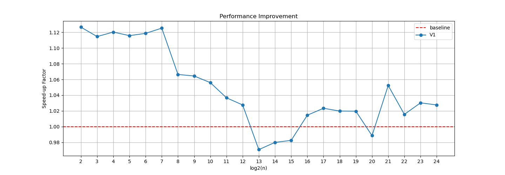
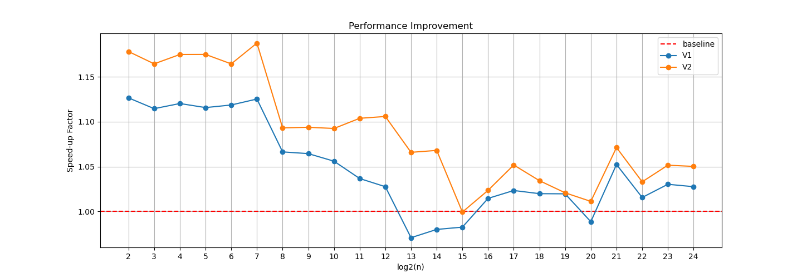
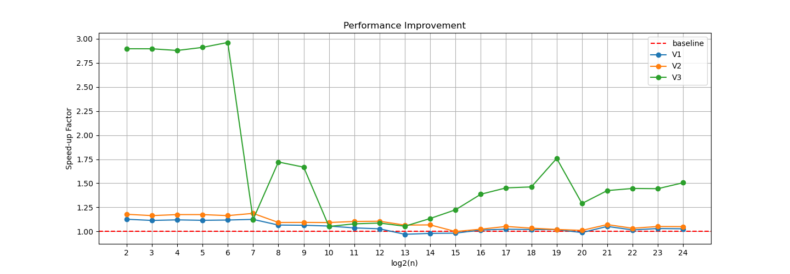
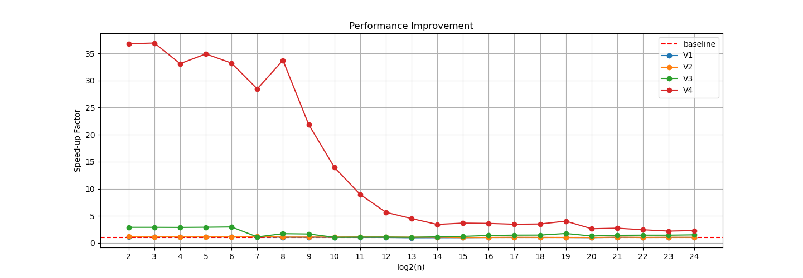

+++ 
draft = true
date = 2025-11-25T01:24:53-05:00
title = "Getting Faster RFFT in Python"
description = ""
slug = ""
authors = []
tags = []
categories = []
externalLink = ""
series = []
+++


**Real Fast Fourier Transform (RFFT)** converts a real-valued signal from the time domain to the frequency domain. Different libraries in Python, such as NumPy, SciPy, and [pyFFTW](https://pyfftw.readthedocs.io/en/latest/source/pyfftw/builders/builders.html), provide an API for RFFT. However, their performance can vary. pyFFTW is a pythonic wrapper around [FFTW](https://www.fftw.org), which is known for its speed in computing Fourier transforms. I couldn't find much documentation on how to get the best performance out of pyFFTW's RFFT. So, I decided to explore this topic and share my findings. Let's dive in!

## Installation
[FFTW](https://www.fftw.org) is one of the requirements of pyFFTW but it does not come with it. You can install `FFTW` through `conda`. I assume you have `conda` installed, and you know how to create and activate a conda environment. See [pyFFTw's github page](https://github.com/pyFFTW/pyFFTW) to learn more about pyFFTW installation, including the minimum Python version requirement.

Once you are in your environment, install `FFTW` by running the following command:
```bash
conda install conda-forge::fftw
```

And the other dependencies can be installed when installing pyFFTW:

```bash
conda install conda-forge::pyfftw
``` 


Now, we are ready to use pyFFTW! As stated in the [pyFFTW documentation](https://pyfftw.readthedocs.io/en/latest/source/tutorial.html#the-pyfftw-builders-functions), the easiest way to use pyFFTW is through the helper functions available in the module `pyfftw.builders`. The following code demonstrates how to use `pyfftw.builders` to perform RFFT on a real-valued array. This is based on [the example provided in the pyFFTW documentation](https://pyfftw.readthedocs.io/en/latest/source/pyfftw/builders/builders.html#module-pyfftw.builders).

```python
import numpy as np
import pyfftw

T = np.random.rand(128)
a = pyfftw.empty_aligned(len(T), dtype='float64')
a[:] = T
rfft_object = pyfftw.builders.rfft(a)

R = rfft_object()
```

## Performance Optimization
RFFT performance varies across input sizes. The performance of RFFT can be significantly improved when input arrays have specific sizes (e.g., powers of two). Here we consider input sizes that are powers of two, and try to find ways to improve the performance of RFFT further in those cases. 


### Timing
Let's start by preparing a script that can get the timing of RFFT computation. This timing function will be used  to evaluate the performance of different RFFT implementations.

```python
def _get_timing_single(n, rfft_caller, timeout=5.0, iter_max=1000000):
    """
    For a single input size n, return the time taken to compute RFFT using rfft_caller
    """
    pyfftw.forget_wisdom()  # clean up any previous plans
    T = np.random.rand(n)

    R = rfft_caller(T) # dummy to create wisdom
    np.testing.assert_allclose(R, np.fft.rfft(T))  # verify correctness

    total_time = 0.0
    count = 0
    while total_time < timeout and count < iter_max:
        start_time = time.perf_counter()
        rfft_caller(T)
        total_time += time.perf_counter() - start_time
        count += 1

    return total_time / count


def get_timing(n_values, rfft_caller, timeout=5.0, iter_max=1000000, verbose=True):
    """
    For multiple input sizes in n_values, return the time taken to compute RFFT using rfft_caller
    """
    timing = np.full(len(n_values), -1.0, dtype='float64')
    for i, n in enumerate(n_values):
        timing[i] = _get_timing_single(n, rfft_caller, timeout=timeout, iter_max=iter_max)
        if verbose:
            print(f"log2(n) --> {int(np.log2(n))}, time: {timing[i]:.6f} sec", flush=True)
    return timing
```

`_get_timing_single` measures the average time to perform an RFFT on an array of size `n` using the supplied `rfft_caller`. The function `get_timing` simply extends this logic to multiple input sizes listed in n_values.

In `_get_timing_single`, we first clear any previously stored FFTW plans (known as “wisdom”) using `pyfftw.forget_wisdom()`. If you’re not familiar with FFTW wisdom, here’s a quick summary: For a new transformation for a new input size, FFTW may spend time exploring different algorithms to find the fastest strategy in the first call. The result of this search, “wisdom”, is essentially a performance recipe that allows future FFTs of the same shape to skip the search entirely. This wisdom is cached by `pyfftw` internally. For a deeper explanation, see [this blog post](TBD). Running `pyfftw.forget_wisdom()` ensures that we start fresh without any cached plans.

Next, we generate a random input array `T` of length `n`. We then perform a dummy RFFT call using `rfft_caller(T)`, mainly to allow FFTW to build the optimal plan (i.e., compute wisdom) ahead of timing. We also validate correctness by comparing the output to NumPy’s `np.fft.rfft` via `np.testing.assert_allclose`. This step is important because it ensures that we are timing a correct implementation.

We then enter a loop that repeatedly computes the RFFT until either the accumulated time exceeds timeout or the iteration count reaches iter_max. Using a time-based stopping criterion is preferable to a fixed iteration count: for small input sizes, RFFT calls are very fast, allowing many iterations and giving more stable timing; for large inputs, calls are slower, so fewer iterations may fit within the timeout. This keeps timing consistent and meaningful across a range of array sizes. Finally, the function returns the average time per RFFT call.

Now that we have the timing functions ready, we can start exploring different implementations of RFFT using pyFFTW to see how we can improve the performance. But, first, let's prepare a script that can help us get the timing results for different implementations and plot the performance improvement.

```python
rfft_callers = {
    'v0': rfft_caller_v0,  # baseline (see below)
    # Add other versions here later
}

p_min = 2
p_max = 24
n_values = np.power(2, np.arange(p_min, p_max + 1))

timing_results = {}
for version, rfft_caller in rfft_callers.items():
    print(f'version: {version}')
    timing_results[version] = get_timing(n_values, rfft_caller=rfft_caller)

plt.figure(figsize=(15, 5))
plt.title('Performance Improvement')

plt.axhline(y=1.0, color='r', linestyle='--', label='baseline')  # baseline
for version, timing in timing_results.items():
    if version == 'v0':
        continue # skip baseline
    plt.plot(
        np.arange(p_min, p_max + 1),
        timing_results['v0'] / timing,
        label=version,
        marker='o'
    )

plt.xticks(
    ticks=np.arange(p_min, p_max + 1),
    labels=np.arange(p_min, p_max + 1),
)
plt.xlabel('log2(n)')
plt.ylabel('Speed-up Factor')
plt.grid()
plt.legend()
plt.show()
```

The above code sets up a framework to compare different RFFT implementations. It defines a dictionary `rfft_callers` to hold different versions of `rfft_caller` functions. It then computes the timing for each version and plots the speed-up factor compared to the baseline version. We are now ready to explore different implementations of RFFT using pyFFTW and see how we can improve the performance! 

Let's start with a baseline implementation of RFFT using pyFFTW. This is based on [the example provided in the documentation](https://pyfftw.readthedocs.io/en/latest/source/pyfftw/builders/builders.html#module-pyfftw.builders)

### Baseline (v0)
```python
import numpy as np
import pyfftw

def _rfft_caller_v0(T):
    """
    Compute the RFFT of the real-valued array T using pyFFTW.
    """
    a = pyfftw.empty_aligned(len(T), dtype='float64')
    a[:] = T
    rfft_object = pyfftw.builders.rfft(a)
    R = rfft_object()

    return R
```

### First Attempt: Reuse array (v1)
One potential optimization is to avoid creating a byte-aligned array on every call. Instead, we can create the byte-aligned array once and reuse it for subsequent calls as long as the size of the input array does not change. This way we are saving the overhead of memory allocation on every call.

```python
class rfft_caller_v1:
    def __init__(self):
        self.real_arr = None

    def __call__(self, T):
        if self.real_arr is None or len(T) != len(self.real_arr):
            self.real_arr = pyfftw.empty_aligned(len(T), dtype='float64')
        
        rfft_obj = pyfftw.builders.rfft(self.real_arr)
        self.real_arr[:] = T
        rfft_obj.execute()
        
        return rfft_obj.output_array

_rfft_caller_v1 = rfft_caller_v1()
```

In this modified version, an instance of the class `rfft_caller_v1` can be used to compute the RFFT. It holds the byte-aligned array `real_arr`, as an attribute, after the first call. When the `__call__` method is invoked again, it checks if the size of the input array `T` matches the size of the existing aligned array. If yes, it reuses the existing byte-aligned array. Let's update the dictionary `rfft_callers` to include this new version:

```python
rfft_callers = {
    'v0': _rfft_caller_v0,
    'v1': _rfft_caller_v1,
}
```

Let's check out the performance improvement. The blue line higher than the red baseline implies "faster". 



As shown in the performance plot above, our first attempt to optimize the RFFT computation resulted in about 2-12% speed-up for most input sizes. It is not clear to me why the performance drops for inputs with sizes `2^13` to `2^15`. I am going to skip the investigation for those cases. Let's see if we can do better!!


### Second Attempt: Tell RFFT to avoid copy (v2)
According to [pyfftw.builders.rfft documentation](https://pyfftw.readthedocs.io/en/latest/source/pyfftw/builders/builders.html#module-pyfftw.builders): 

> By default, these functions will always create a copy (and sometimes more than one) of the passed-in input array. This is because the creation of the pyfftw.FFTW object generally destroys the contents of the input array.

> This only influences a copy during the creation of the object

In our case, the byte-aligned array `real_arr` is used when creating the RFFT object. And, then, it is filled with the contents of `T` right before executing the RFFT object. Therefore, at the time of creating the RFFT object, the contents of `real_arr` are not important as they will be overwritten. We do this by setting the `avoid_copy` parameter to `True` to avoid unnecessary copying of data at the time of creating the RFFT object.

```python
class rfft_caller_v2:
    def __init__(self):
        self.real_arr = None

    def __call__(self, T):
        if self.real_arr is None or len(T) != len(self.real_arr):
            self.real_arr = pyfftw.empty_aligned(len(T), dtype='float64')
        
        rfft_obj = pyfftw.builders.rfft(self.real_arr, avoid_copy=True)
        self.real_arr[:] = T
        rfft_obj.execute()
        
        return rfft_obj.output_array

_rfft_caller_v2 = rfft_caller_v2()
```

Let's update the dictionary `rfft_callers` to include this new version, and check out the performance improvements.

```python
rfft_callers = {
    'v0': rfft_caller_v0,
    'v1': rfft_caller_v1,
    'v2': rfft_caller_v2,
}
```

In the performance plot below, the orange line represents the performance of this new version (v2). The higher the line, the better the performance.



As shown in the performance plot above, our second attempt to optimize the RFFT computation resulted in about 5%-15% speed-up relative to the baseline. 


### Third Attempt: Use pyfftw.FFTW directly (v3)
In the previous versions, we used `pyfftw.builders.rfft` to create the RFFT object. As mentioned in [pyfftw.builders documentation](https://pyfftw.readthedocs.io/en/latest/source/pyfftw/builders/builders.html), the goal of builder functions is to provide a convenient interface for creating FFTW objects. Under the hood, any builder function returns an object that is an instance of `_FFTWWrappe`, which is a child class of `pyfftw.FFTW`. One potential optimization is to use `pyfftw.FFTW` directly. This might save some overhead associated with the builder functions.


```python
class rfft_caller_v3:
    def __init__(self):
        self.real_arr = None
        self.complex_arr = None

    def __call__(self, T):
        if self.real_arr is None or len(T) != len(self.real_arr):
            self.real_arr = pyfftw.empty_aligned(len(T), dtype='float64')    
            self.complex_arr = pyfftw.empty_aligned(len(T) // 2 + 1, dtype='complex128')

        rfft_obj = pyfftw.FFTW(
                self.real_arr,
                self.complex_arr,
                direction='FFTW_FORWARD',
            ) 
       
        self.real_arr[:] = T
        rfft_obj.execute()

        return self.complex_arr

_rfft_caller_v3 = rfft_caller_v3()
```

As shown above, we now need to provide the output array `complex_arr` to hold the RFFT result. And, we also pass `direction='FFTW_FORWARD'` to indicate that we want to perform the forward transformation. The `pyfftw.FFTW` class then infers that we want to compute RFFT based on the data types of the input and output arrays. We lose some convenience compared to the builder interface, but we may gain performance. Let's update the dictionary `rfft_callers` to include this new version, and check out the performance improvements.


```python
rfft_callers = {
    'v0': rfft_caller_v0,
    'v1': rfft_caller_v1,
    'v2': rfft_caller_v2,
    'v3': rfft_caller_v3,
}
```



The speed-up now ranges from 25% to 300% for most input sizes! To be more specific, for input sizes `<= 2^6`, the current version is around 3x times faster than the baseline! For input sizes `>= 2^15`, the performance gain is between 25% to 75%. It is not clear why the performance is not monotonic with respect to input size. Investigating that is out of the scope of this post. Overall, using `pyfftw.FFTW` directly resulted in a significant performance improvement compared to using the builder function.

### Fourth Attempt: Reuse the RFFT object (v4)
As our last attempt, we can try to reuse the RFFT object across multiple calls when the input size does not change. This avoids the overhead of creating a new RFFT object on every call.

```python
class rfft_caller_v4:
    def __init__(self):
        self.real_arr = None
        self.complex_arr = None
        self.rfft_obj = None
    
    
    def __call__(self, T):
        if self.real_arr is None or len(T) != len(self.real_arr):
            self.real_arr = pyfftw.empty_aligned(len(T), dtype='float64')    
            self.complex_arr = pyfftw.empty_aligned(len(T) // 2 + 1, dtype='complex128')

            self.rfft_obj = pyfftw.FFTW(
                    self.real_arr,
                    self.complex_arr,
                    direction='FFTW_FORWARD',
                    flags=('FFTW_MEASURE',),
                    threads=1,
                ) 
           
        self.real_arr[:] = T
        self.rfft_obj.execute()

        return self.complex_arr

_rfft_caller_v4 = rfft_caller_v4()
```

And we can check the performance by updating the dictionary `rfft_callers`, and running the plot script.

```python
rfft_callers = {
    'v0': rfft_caller_v0,
    'v1': rfft_caller_v1,
    'v2': rfft_caller_v2,
    'v3': rfft_caller_v3,
    'v4': rfft_caller_v4,
}
```



As shown in the performance plot above, reusing the RFFT object resulted in a further performance improvement. For arrays with input size `<= 2^8`, the current version is 30-35x faster than the baseline! From that point onward, the performance gain reduces as the input size increases, but it is still around 2x faster for input size `2^24`. This is a significant improvement compared to our baseline implementation! If the application requires frequent RFFT computations on arrays of same size, then this approach can be very beneficial as one can store the `rfft_caller_v4` instance and reuse it across multiple calls.


## Conclusion
In this post, we explored different ways to optimize the performance of RFFT computation using pyFFTW in Python. We started with a baseline implementation and gradually improved it by applying various optimizations, such as byte-aligning the input array, using the `pyfftw.FFTW` object directly, and reusing the RFFT object across multiple executions. We did not explore multithreading here, but it may offer further performance gains, especially for large arrays.