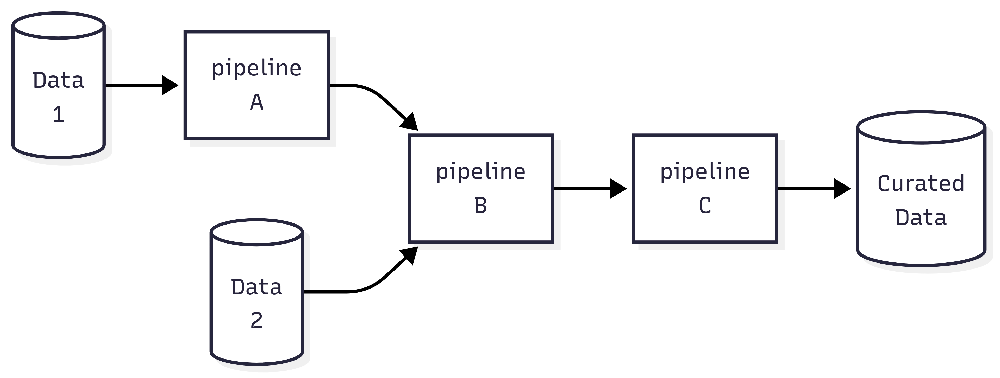

+++
date = '2025-08-27T07:57:50-04:00'
draft = false
title = 'Impact and Root Cause'
+++

Let's say you are running an application to process some data for your client. The application consists of several pipelines. And it is not unusual to see some failures from time to time. And your client wants to know the answer to two questions: (i) what is the impact?, and (ii) what is the root cause?

How do you deal with that? Of course, to resolve different issues you need to have different set of skills and knowledge. Here I am only trying to provide a general framework.  Let's say the pipelines are connected as follows:

Let's consider three scenarios:  
(1) An issue is observed in the curated output  
(2) An issue is observed in the pipeline `A`  
(3) An issue is observed in the data that is fed into the pipeline `C`  

In the first case, the impact is clear. To understand the root cause, one needs to move backward to pinpoint the issue. You may not have proper knowledge or access to all components as different components can be managed by different teams. We start from the very end, and ask the responsible team to take a look at the process and the data they consume. They may say: "Hey... there is an issue in the data that is fed into the last pipeline". That's a progress. We know that the issue is coming from the upstream jobs. However, a sentence like "there is an issue in the data" does not help that much! The responsible team should provide a statement like: "The expectation was to see X but we noticed it is Y". Now the team that is responsible for the upstream job knows "what" needs to be investigated. They can take it from there, and then move backward. 

In the second case, the root cause might be already clear. However, understanding the impact on the end user might requires some investigation. The team that is responsible for the pipeline `A` should provide the impact on the output of the pipeline. The next team in the process should take it from there and understand what can be the impact on their output data, and so on.  Finally, the last team can reveal the impact on the end user.

In the third case, we may need to go BOTH backward (to understand root cause) and forward (to understand the impact on the end user).

To have effective communication, each team needs to know to whom they should communicate with! For each pipeline, its actual client is the user of that pipeline's outcome! So, the next time you see something is wrong, try to first understand what is expected and why you observed instead. And then contact the next team in the chain! 